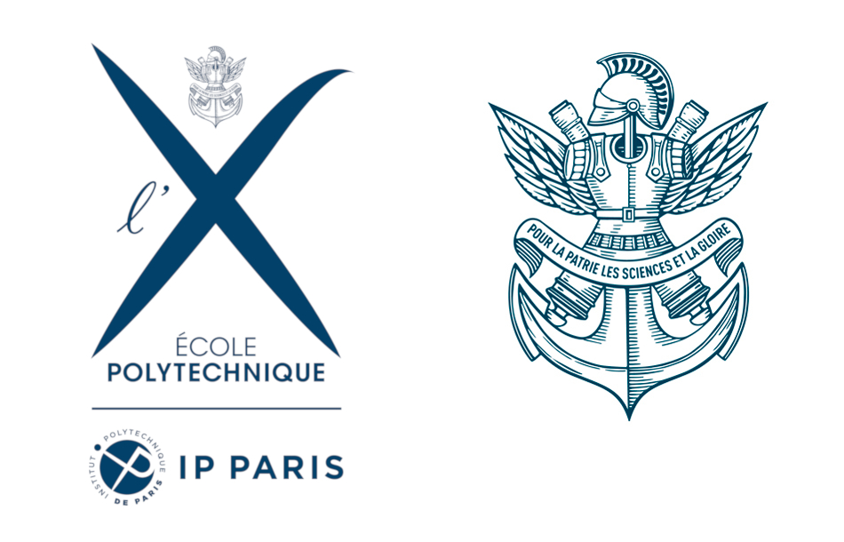

# Polytechnique [CSE204-2020](https://moodle.polytechnique.fr/course/view.php?id=10682)

These courses were made by [Jérémie Decock](http://www.jdhp.org/) ([lab sessions 01 to 04](https://github.com/jeremiedecock/polytechnique-cse204-2018)), [Théo Lacombe](https://tlacombe.github.io/) (lab exam 05) and [James B. Scoggins](https://jbscoggi.github.io/website/) ([lab sessions 06 to 13](https://github.com/jbscoggi/teaching/tree/master/Polytechnique/CSE204)) for [CSE204-2018](https://moodle.polytechnique.fr/enrol/index.php?id=6784), slightly amended and put together by [Pawel Guzewicz](http://www.lix.polytechnique.fr/Labo/Pawel.Guzewicz/) and I ([Adrien Ehrhardt](https://adimajo.github.io/)).

## Moodle

[Moodle Link](https://moodle.polytechnique.fr/course/view.php?id=10682)

### Welcome to CSE204 Machine Learning!

Machine learning is an increasingly important area, and it has provided many of the recent advances behind applications of artificial intelligence. It is relevant to a plethora of application domains in science and industry - including in finance, health, transport, linguistics, media, and biology. Lectures will cover the many of the main concepts and algorithms. We will cover in some degree all the main paradigms of machine learning: supervised learning (regression, classification), unsupervised learning, and reinforcement learning. Among many learning algorithms we will look at: least squares, logistic regression, k-nearest neighbors, neural networks and deep learning, decision tree inducers, kernel methods, PCA, k-means clustering, and Q-learning. In the labs, we will implement many of these, and investigate their use in different applications. Programming will be done in Python with scientific libraries such as numpy and scikit-learn. The main grading component is a team project, as well as several in-class tests.

**Lab sessions:**

[nbgitpuller](https://jupyter.dix.polytechnique.fr/hub/user-redirect/git-pull?repo=https%3A%2F%2Fgithub.com%2Fadimajo%2Fpolytechnique-cse204-2020-releases&branch=main)

[JupyterHub](https://jupyter.dix.polytechnique.fr/)

If JupyterHub does not work (eduroam network):

Jupyter Notebooks can be executed locally, in which case Anaconda (2019.10 or above ; Python 3.7 or above) is strongly recommended.
If the conda command does not work, it's that conda is not in the PATH environment variable. You may add it by figuring out the path to Anaconda and use the command:

`export PATH="PATH_TO_ANACONDA/bin:$PATH"`

`conda init`

We use `nbgrader` extensively: cells in which you have to input your own code are clearly shown; other cells are read-only. You may test your answers with the "Validate" button of the "Assignment list" in Jupyter Notebook. Warning: this is only available through a local installation and requires the installation of nbgrader using:

`conda install -c conda-forge nbgrader`

`jupyter nbextension install --user --py nbgrader --overwrite`

`jupyter nbextension enable --user --py nbgrader`

Although all notebooks rely on nbgrader, only sessions 05 and 12 are graded.
If you choose the "Local" version of the lab sessions, right click on the link > Save Link as...
If you wish to execute the notebooks on the machines of the Salle d'Informatique, download [this conda_environment.yml](conda_environment.yml) file open a terminal prompt and enter:

`conda env create -f conda_environment.yml`

`python -m ipykernel install --user --name cse204 --display-name "cse204"`

This will install all dependencies in a new conda environment named cse204. Once on the Notebook, don't forget to use Kernel > Change Kernel to use the Python (cse204) environment.
If the conda environment cse204 already exists, you may delete it with the following command:

`conda remove --name cse204 --all`

To launch Jupyter, use:

`jupyter-notebook --ip=0.0.0.0 --port=8080`

